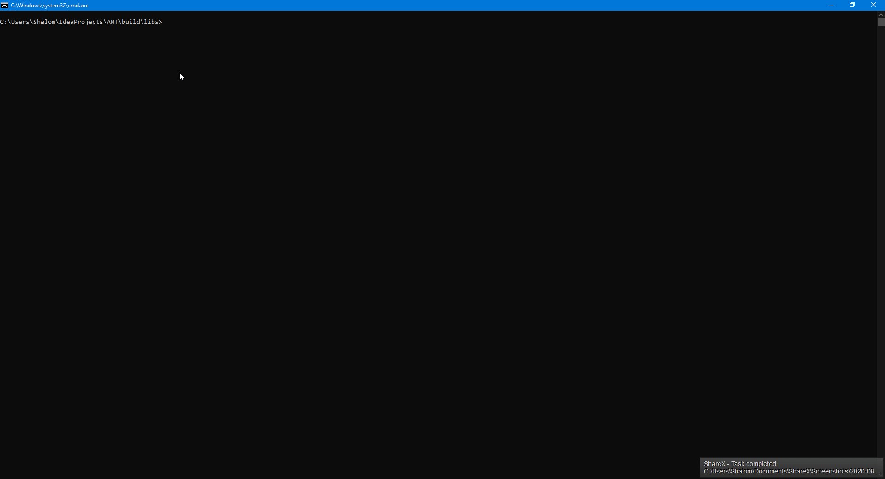

# AMT 
The simple minecraft mod package manager

Example:

AMT uses a combination of a frontend client (which is stored in this repository), and a backend which is ran on a server to host the mod jars. 

TODO:

- [x] Base for installing packages
- [] Deleting packages
- [] Updating packages
- [] Add repositories
- [] Delete repositories

Author: ChachyDev